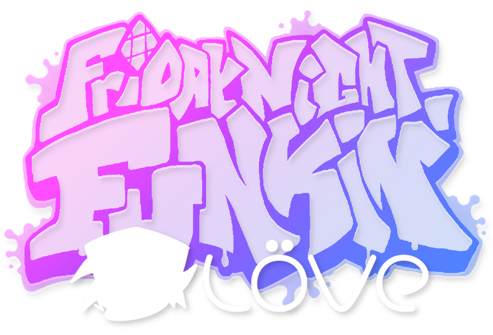

#  FNF Löve

A port of <a href="https://funkin.me">Friday Night Funkin'</a> to the <a href="https://love2d.org">LÖVE</a> game engine.

##  Discord Server

## Dev Team

- Stilic (owner)
- Raltyro
- Victor Kaoy
- FowluhhDev

## Libraries

- [baton](https://github.com/tesselode/baton)\*
- [classic](https://github.com/rxi/classic)
- [gamestate](https://github.com/vrld/hump/blob/master/gamestate.lua)\*
- [json](https://github.com/actboy168/json.lua)\*
- [lua-discordRPC](https://github.com/pfirsich/lua-discordRPC)
- [lua-https](https://github.com/love2d/lua-https)
- [timer](https://github.com/vrld/hump/blob/master/timer.lua)\*
- [Lua-Simple-XML-Parser](https://github.com/Cluain/Lua-Simple-XML-Parser)\*

* Was modified for our needs.
