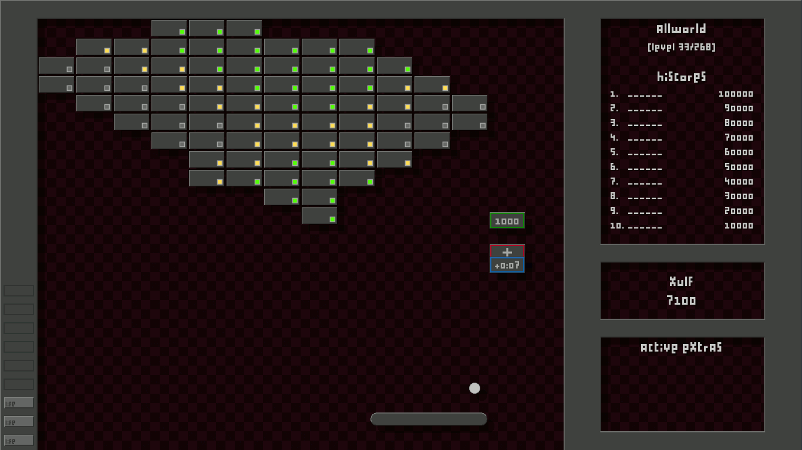

# Liferation

## Installation (Linux)

~~~
mkdir -p ~/.lbreakouthd/themes
cd ~/.lbreakouthd/themes
~~~

Then just clone this repository...

~~~
git clone https://framagit.org/ohnonot/Liferation
# or
git clone https://notabug.org/ohnonot/Liferation
~~~

...or download the zip and extract it.

Now you can select it from LBreakoutHD's Settings => Graphics => Theme.

It looks best if you also download this font for the UI:  
https://dl.dafont.com/dl/?f=proliferation (free for personal use)  
Just unzip it into the Liferation directory.

## Credits

A development of the Combustion theme created by Oleg qvfgnag_uvyyf@znvy.eh(rot13)
for lbreakout2: https://lgames.sourceforge.io/LBreakout2/themes/combustion.zip

I used Louis Rigaud's Proliferation font in some graphics.

All graphics created or modified with GIMP.

## Sound

Creating nice sounds from scratch proved to be much harder than I thought.

There are some sounds in the `stuff/wav/` folder. If you want to try them you can copy them to the theme folder.

Sounds were created with

- SFXR http://www.drpetter.se/project_sfxr.html
- Audacity https://scaryreasoner.wordpress.com/2008/04/13/video-tutorial-how-to-create-explosion-sound-effects-in-audacity/
- `espeak -p 10 -s 140 -k10 "Excellent!" -v variant`  
	`espeak -p 0 -s 140 -k50 "Very good!" -v variant`
- sox (see script in `stuff/sound/sox`)

##  Other stuff

`paddle.png` and `shine.png` have alternatives in `stuff/paddles` and `stuff/shines`.

The XCF files I used (for GIMP) are also included.

Copyleft 2022: buababg-tvguho@cbfgrb.qr(rot13)
